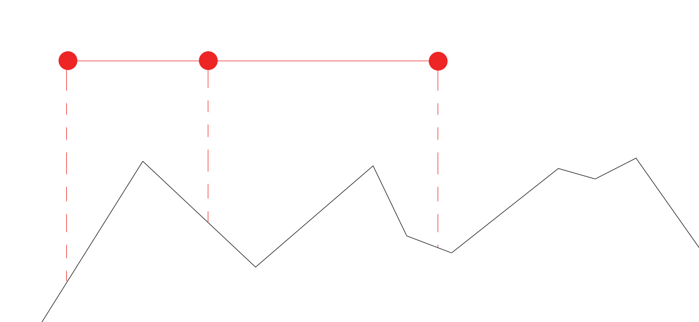
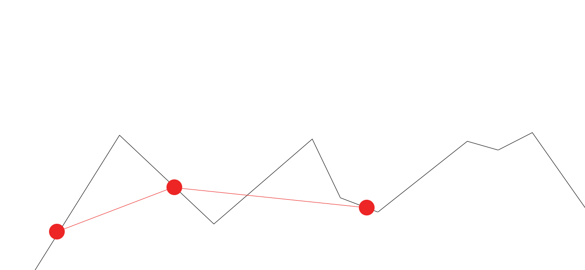
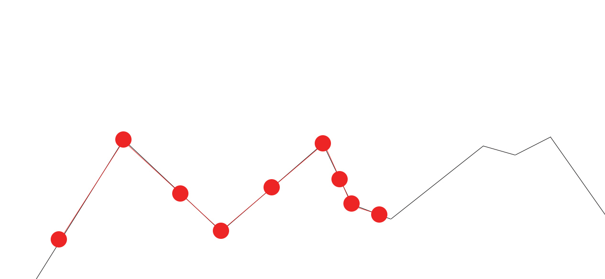
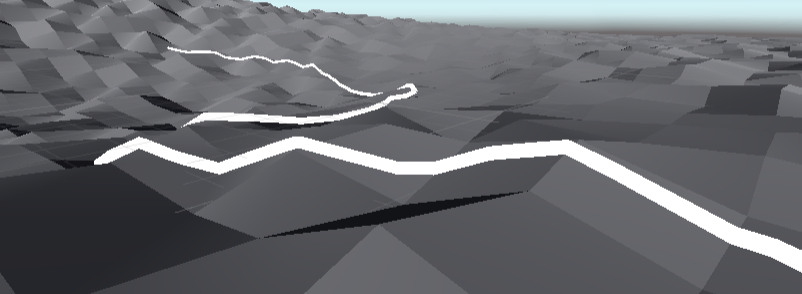

# Construction de routes à partir de données numériques

Application Unity3D 2019.4.10f1 par *Valentin LAMPRIERE* (***valentinLampriere***) et *Mathieu LIVEBARDON* (***Tsuno96***)

# Contexte

Travail réalisé dans le cadre du cours de Mondes Virtuels en Master 2 Informatique encadré par Gilles Gesquière.

# Sources

**Json Parsing in Unity By using Newton json Plugin(JSON .Net) and Jsonutility** par *Nested Mango*
- https://www.youtube.com/watch?v=osWRH8M1H5s

**Intersection point between two lines in 2D** sur le blog de *Dakwamine*
- https://blog.dakwamine.fr/?p=1943


# GeoJSON

Les données fournies sont sous la forme de GeoJSON.
Le GeoJSON est un format de données basé sur le JSON, celui-ci permet de représenter des caractéristiques géographiques simples.

Pour les routes il est notamment écrit les coordonnées des points de la route, sa largeur, son nom, son sens...

## JSON -> CS

Les fichiers json doivent être convertis pour pouvoir les utiliser en c# (https://json2csharp.com/)

### Exemple :
Dans cet exemple nous pouvois voir un fichier geojson comportant une route stockée en JSON, puis les classes C# associées.

```json
{
"type": "FeatureCollection",
"name": "uneRoute",
"features": [
{ "type": "Feature", "properties": { "ID": "TRONROUT0000000013570411", "PREC_PLANI": 2.5, "PREC_ALTI": 2.5, "NATURE": "Route ? 1 chauss?e", "NUMERO": "NC", "NOM_VOIE_G": null, "NOM_VOIE_D": null, "IMPORTANCE": "5", "CL_ADMIN": "Autre", "GESTION": "NC", "MISE_SERV": "NR", "IT_VERT": "Non", "IT_EUROP": "NC", "FICTIF": "Non", "FRANCHISST": "NC", "LARGEUR": 4.0, "NOM_ITI": "NC", "NB_VOIES": 2, "POS_SOL": 0, "SENS": "Double", "ALIAS_G": null, "ALIAS_D": null, "INSEECOM_G": "69153", "INSEECOM_D": "69153", "CODEVOIE_G": "NR", "CODEVOIE_D": "NR", "CODEPOST_G": "69250", "CODEPOST_D": "69250", "TYP_ADRES": "Classique", "BORNEDEB_G": 0, "BORNEDEB_D": 0, "BORNEFIN_G": 0, "BORNEFIN_D": 0, "ETAT": "NR", "Z_INI": 509.9, "Z_FIN": 530.4, "nom": "POLEYMIEUX-AU-MONT-D'OR", "nomreduit": "POLEYMIEUX", "insee": "69153", "gid": "50" }, "geometry": { "type": "MultiLineString", "coordinates": [ [ [ 1838793.551783810602501, 5184847.424265308305621, 509.9 ], [ 1838792.850053697358817, 5184841.419601845555007, 509.6 ], [ 1838799.451238062465563, 5184820.401515176519752, 510.1 ], [ 1838820.661214229883626, 5184784.568742555566132, 510.4 ], [ 1838829.765294297132641, 5184768.153849138878286, 510.1 ], [ 1838834.566812368342653, 5184756.24339422956109, 510.1 ], [ 1838838.567729415604845, 5184744.533255526795983, 510.1 ], [ 1838841.267489495920017, 5184732.222890703007579, 510.1 ], [ 1838841.365247989306226, 5184720.313353234902024, 510.1 ], [ 1838839.161205951590091, 5184708.604424611665308, 510.1 ], [ 1838834.555264007300138, 5184696.996044328436255, 510.0 ], [ 1838825.943548337556422, 5184672.177887592464685, 510.2 ], [ 1838813.828566168667749, 5184644.958494935184717, 510.3 ], [ 1838804.717797740828246, 5184627.045955074951053, 510.4 ], [ 1838798.309890944277868, 5184612.735767796635628, 510.8 ], [ 1838784.49113352317363, 5184573.106793055310845, 511.1 ], [ 1838779.483489111764356, 5184554.39281546510756, 511.1 ], [ 1838775.678442323580384, 5184544.085320726037025, 511.1 ], [ 1838768.771306960843503, 5184535.780029663816094, 511.1 ], [ 1838761.56457527843304, 5184530.777435647323728, 511.1 ], [ 1838751.555663441773504, 5184526.075627325102687, 511.1 ], [ 1838727.635053318459541, 5184518.374129743315279, 510.5 ], [ 1838659.176195531385019, 5184496.970348880626261, 511.2 ], [ 1838650.568988549988717, 5184495.270665109157562, 510.6 ], [ 1838641.561461804201826, 5184493.571059159003198, 512.8 ], [ 1838630.051332518924028, 5184488.769461585208774, 514.5 ], [ 1838628.548204977996647, 5184478.861838752403855, 515.0 ], [ 1838634.050050491467118, 5184465.750294293276966, 515.9 ], [ 1838644.755215317709371, 5184448.334299477748573, 516.2 ], [ 1838653.258192321984097, 5184428.716974803246558, 516.5 ], [ 1838657.757718052249402, 5184407.799390645697713, 517.4 ], [ 1838656.15176353091374, 5184383.780517459847033, 518.7 ], [ 1838643.636823836714029, 5184358.362649366259575, 520.0 ], [ 1838626.518773178802803, 5184335.847995817661285, 521.2 ], [ 1838609.502264119219035, 5184320.839317532256246, 521.5 ], [ 1838579.474294712301344, 5184300.32877454906702, 523.0 ], [ 1838566.057608157163486, 5184269.606847447343171, 525.3 ], [ 1838560.450290419626981, 5184254.996269528754056, 525.9 ], [ 1838549.437217012280598, 5184232.980829321779311, 527.5 ], [ 1838535.822358555393293, 5184212.46709434594959, 529.0 ], [ 1838531.117493309313431, 5184206.763454185798764, 530.4 ] ] ] } }
]
}
```
```cs
// Root myDeserializedClass = JsonConvert.DeserializeObject<Root>(myJsonResponse);
    public class Properties    {
        public string ID { get; set; }
        public double PREC_PLANI { get; set; }
        public double PREC_ALTI { get; set; }
        public string NATURE { get; set; }
        public string NUMERO { get; set; }
        public object NOM_VOIE_G { get; set; }
        public object NOM_VOIE_D { get; set; }
        public string IMPORTANCE { get; set; }
        public string CL_ADMIN { get; set; }
        public string GESTION { get; set; }
        public string MISE_SERV { get; set; }
        public string IT_VERT { get; set; }
        public string IT_EUROP { get; set; }
        public string FICTIF { get; set; }
        public string FRANCHISST { get; set; }
        public double LARGEUR { get; set; }
        public string NOM_ITI { get; set; }
        public int NB_VOIES { get; set; }
        public int POS_SOL { get; set; }
        public string SENS { get; set; }
        public object ALIAS_G { get; set; }
        public object ALIAS_D { get; set; }
        public string INSEECOM_G { get; set; }
        public string INSEECOM_D { get; set; }
        public string CODEVOIE_G { get; set; }
        public string CODEVOIE_D { get; set; }
        public string CODEPOST_G { get; set; }
        public string CODEPOST_D { get; set; }
        public string TYP_ADRES { get; set; }
        public int BORNEDEB_G { get; set; }
        public int BORNEDEB_D { get; set; }
        public int BORNEFIN_G { get; set; }
        public int BORNEFIN_D { get; set; }
        public string ETAT { get; set; }
        public double Z_INI { get; set; }
        public double Z_FIN { get; set; }
        public string nom { get; set; }
        public string nomreduit { get; set; }
        public string insee { get; set; }
        public string gid { get; set; }
    }

    public class Geometry    {
        public string type { get; set; }
        public List<List<List<double>>> coordinates { get; set; }
    }

    public class Feature    {
        public string type { get; set; }
        public Properties properties { get; set; }
        public Geometry geometry { get; set; }
    }

    public class Root    {
        public string type { get; set; }
        public string name { get; set; }
        public List<Feature> features { get; set; }
    }

```
## JSONdotNET
***JsonParser.cs***


**JSONdotNET For Unity** est un package qui ajoute un outil de déserialisation de JSON.

Il s'utilise en C# de la manière suivante :
```cs
JsonConvert.DeserializeObject<Root>(strFile);
```

# Les routes et le terrain


## Les routes

***Road.cs***

Les routes sont représentées par des LineRenderer. Le LineRenderer est un objet *Unity3D* utile pour représenter des lignes à partir d'une liste de coordonnées, il offre également la possibilité de définir la largeur de la ligne.

```cs
public float largeur { get; }
public List<Vector3> positions { get; }
```

## Le terrain

Le terrain est un objet *3D* (un mesh) comportant un composant **MeshCollider**. Ce dernier est nécéssaire pour les test de collision. Par soucis de simplicité, un terrain à été créer à l'aide de *Blender* (*NB : il s'agit d'un terrain "test" pour l'exercice*).

# Application des routes sur le terrain

***Manager.cs***

## Régler la position du terrain

- Effectuer une rotation ainsi qu'une translation sur le terrain. Ces transformations sont appliquées pour pallier le fait que le pivot de l'objet terrain n'est pas au centre du maillage et que l'axe Z et l'axe Y sont inversé sur Unity3D.

```cs
Mesh mesh = terrain.GetComponent<MeshFilter>().mesh;
offset = mesh.bounds.center;
// Create a new Empty Gameobject
GameObject parent = new GameObject("mapCenter");
// Set it position to the center of the terrain mesh
parent.transform.position = mesh.bounds.center;
// Set it as a parent in the hierarchy
terrain.transform.parent = parent.transform;
// Reset it position to zero (this way it also reset the terrain position)
parent.transform.position = Vector3.zero;
// Rotate the object in the X axis
parent.transform.Rotate(Vector3.right, -90);

```

## Création de la liste de route

Pour chaque position de chaque route on définit la position en fonction des données extraitent du JSON auxquelles on applique un décallage sur l'axe **x** et sur l'axe **z** (L'axe **y** est la hauteur) dans le but de recentrer les routes dans la scène.   

```cs
// Loop through every positions in roads
for (int i = 0; i < f.geometry.coordinates[0].Count; i++) {
    List<double> l = f.geometry.coordinates[0][i];
    float x = (float)l[0] - xOffset;
    float z = (float)l[1] - zOffset;
```

### Calcul de la hauteur (l'axe **y**)

Les données d'altitude définies dans les GeoJSON sont parfois érronées, elles doivent donc être recalculées grâce aux données du terrain.

Pour parvenir à ce problème, des rayons sont lancés depuis chaque position de chaque route. Lorsque le rayon rencontre le terrain, la coordonnée Y à l'impact est récupérée. Celle-ci devient la coordonnée Y sur la route.



Un probleme se dégage : les routes traversent ou survolent le terrain entre les points que composent la route.



Pour régler ce problème des points intermédiaires doivent être ajoutés sur les routes.

L'ajout de points se fait en deux étapes qui sont :

Lors de l'ajout des points sur la route, chaque points consécutifs doivent se trouver sur des triangles partageant une même arrête. Dans le cas ou la condition n'est pas validée, un point intermédiaire vérifiant la condition est calculé.
- Pour chaque triangles survolé ou traversé par la route, un point est ajouté.
- Pour chaque arrêtes du terrain entre deux points de la route, un point est ajouté sur cette dernière.


Calcul d'un point au centre du segment de route défnie par `previousVertice` et `temporaryPoint` :
```cs
Vector3 verticeInTheMiddle = previousVertice + (temporaryPoint - previousVertice) * 0.5f;
```


- Des points sur chaque arrête des triangles


A cette étape, la route est composé d'au moins un point par triangle du terrain sur lequel elle repose. Or comme indiqué ci-dessus certaines portions de routes traversent toujours le terrain. Il suffit d'ajouter un point sur la route à la coordonnée définie par l'intersection entre l'arrête et la route.


Méthode permettant de trouver l'intersection entre les segment A1 A2 et B1 B2 :
```cs
/// <summary>
/// Gets the coordinates of the intersection point of two lines.
/// </summary>
/// <param name="A1">A point on the first line.</param>
/// <param name="A2">Another point on the first line.</param>
/// <param name="B1">A point on the second line.</param>
/// <param name="B2">Another point on the second line.</param>
/// <param name="found">Is set to false of there are no solution. true otherwise.</param>
/// <returns>The intersection point coordinates. Returns Vector2.zero if there is no solution.</returns>
public Vector2 GetIntersectionPointCoordinates(Vector2 A1, Vector2 A2, Vector2 B1, Vector2 B2, out bool found) {
float tmp = (B2.x - B1.x) * (A2.y - A1.y) - (B2.y - B1.y) * (A2.x - A1.x);

if (tmp == 0) {
    // No solution!
    found = false;
    return Vector2.zero;
}

float mu = ((A1.x - B1.x) * (A2.y - A1.y) - (A1.y - B1.y) * (A2.x - A1.x)) / tmp;

found = true;

return new Vector2(
    B1.x + (B2.x - B1.x) * mu,
    B1.y + (B2.y - B1.y) * mu
);
}
```



# Resultat



# Points d'amélioration

- Ajout de mesh pour les routes afin d'éviter l'utilisation de LineRenderer ;
- Calquer les routes sur les coordonnées du terrain ;
- Optimiser le temps de calcul à l'aide d'un système asynchrone (Calculer indépendamment chaque route).
